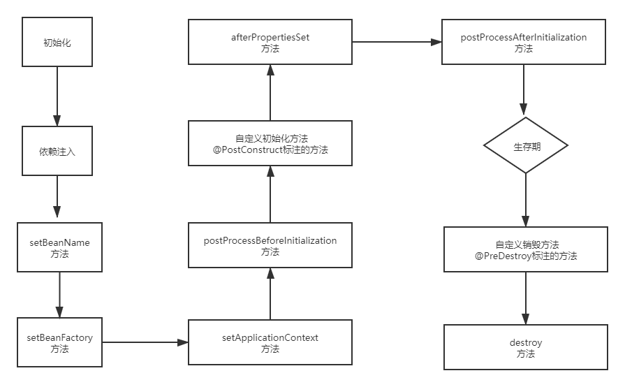

## Bean生命周期？

---

Spring Ioc初始化和销毁Bean的过程，这个就是Bean的生命周期。它大致分为**Bean定义、Bean的初始化、Bean的生存期和销毁**4个部分。

## Spring初始化Bean的过程
---
>1.资源定位 

Spring通过我们的配置,比如：@ComponentScan定义的扫描路径去找到带有@Component的类，这就是资源定位的过程。
>2.Bean定义

找到了资源以后，开始解析，并且将定义的信息保存起来。此时还没有初始化Bean，也自然就没有Bean的实例，仅仅存在Bean的定义。
>3.发布Bean定义    
---
Ioc容器装载Bean的定义，此时依旧只有Bean的定义，没有Bean的实例。
>4.实例化：创建Bean的实例对象
---
>5.依赖注入：比如@Autowired注入的各类资源

正常情况下Spring Ioc会在Bean的定义发布以后，直接进行Bean的实例化和依赖注入，并不会等到程序走到获取Bean的时候才完成这些。有些特殊的Bean会收到变化因素的影响，这个时候我们更希望的是**取出Bean**的时候再进行实例化和依赖注入，我们可以通过@Component
的一个配置项**lazyInit**,要求是Boolean值，默认是false，不进行延迟初始化，设置为true，则再获取bean的时候进行实例化和依赖注入。

## 详细的流程图

其中我们的关注**BeanPostProcessor**这个接口（Bean后置处理器），源码如下：
```java
public interface BeanPostProcessor {
    //这两个方法都针对所有的Bean生效
    //预初始化方法
    @Nullable
    default Object postProcessBeforeInitialization(Object bean, String beanName) throws BeansException {
        return bean;
    }
    //后初始化
    @Nullable
    default Object postProcessAfterInitialization(Object bean, String beanName) throws BeansException {
        return bean;
    }
}

```
除了后置处理器的这两个方法，其他的都是针对单个bean生效的。需要这两个方法的时候只需要定义一个类实现**BeanPostProcessor**这个接口并重写这两个方法。
**第五步**的**setApplicationContext**的方法被调用的前提是自己的Ioc容器要实现**ApplicationContext**接口，否则不会执行。

## 测试生命周期
```java

@Component
public class BeanLife implements BeanNameAware, BeanFactoryAware, ApplicationContextAware , 
InitializingBean, DisposableBean {

    public BeanLife(){
        System.out.println("构造方法=====");
    }
    @Override
    public void setBeanName(String s) {
        System.out.println("===调用setBeanName方法，名称："+s);
    }

    @Override
    public void setBeanFactory(BeanFactory beanFactory) throws BeansException {
        System.out.println("====调用setBeanFactory方法");
    }

    @Override
    public void setApplicationContext(ApplicationContext applicationContext) throws BeansException {
        System.out.println("=====调用setApplicationContext方法");
    }
    @PostConstruct
    public  void init(){
        System.out.println("执行自定义初始化方法PostConstruct");
    }
    @Override
    public void afterPropertiesSet() throws Exception {
        System.out.println("=====调用afterPropertiesSet方法");
    }
    @PreDestroy
    public void destory1(){
        System.out.println("=====调用自定义销毁方法");
    }

    @Override
    public void destroy() throws Exception {
        System.out.println("=====调用destroy方法");
    }

}

构造方法=====
===调用setBeanName方法，名称：beanLife
====调用setBeanFactory方法
=====调用setApplicationContext方法
===开始执行postProcessBeforeInitialization方法
执行自定义初始化方法PostConstruct
=====调用afterPropertiesSet方法
===开始执行postProcessAfterInitialization方法
```